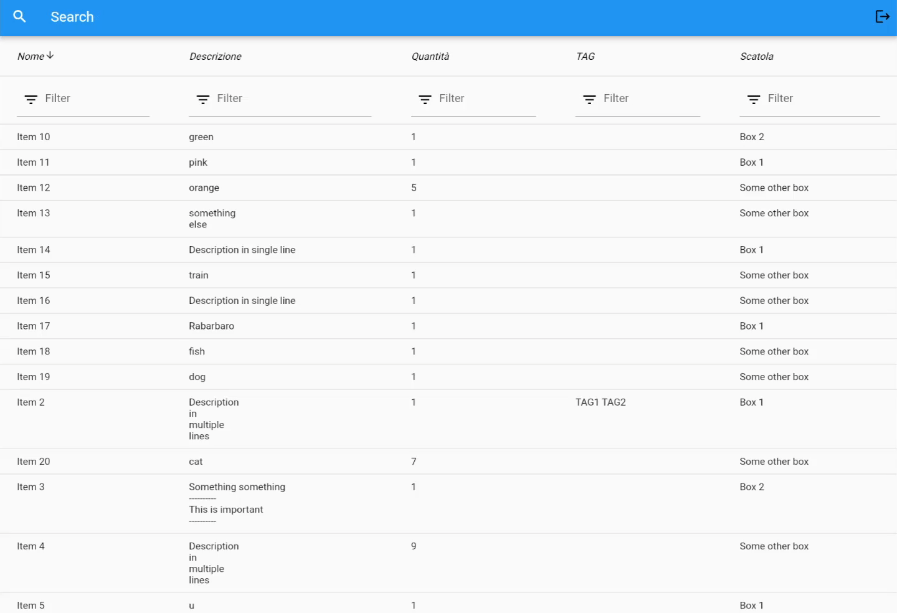

# db_mono_table

Site to visualize a db in a single table view.

This is a simple project made by writing things during my spare time, so don't expect any real structure behind it. 

This is meant to be used primarily on touchscreen panels so support for scrolling with a mouse is limited.

It supports login/logout, columns filtering, columns sorting and backend searches.

To change the structure of the table displayed it's sufficient to change the variable ```COLUMNS``` in ```table_object.dart``` with the values provided by the backend.
Note that the values are mapped in order (i.e. i-th value in the json from the API is mapped to the i-th column). The last value from the json is used as a boxtip for the last column.

## Example



## API

The frontend relies on an API whose structure is as follows:

```(bash)
/api/v1/login

    POST
        with json payload
            {
                "user": String
                "password": String
            }

        Returns
            401 if wrong combination user & password
            
            202 if accepted and 
                {
                    "token": String
                }
```

```(bash)
/api/v1/logout

    POST
        with header 
            'Authorization': 'Bearer $token'
    
        Returns 
            401 if not authorized
            200 if authorized
```

```(bash)
/api/v1/objects

    GET
        with header 
            'Authorization': 'Bearer $token'
        with optional query string
            search=String
    
        Returns 
            401 if not authorized

            200 if authorized and 
                [
                    {
                        "name": String,
                        "description": String,
                        "quantity": String,
                        "TAG": String,
                        "box": String,
                        "place": String
                    },
                    {
                        "name": String,
                        "description": String,
                        "quantity": String,
                        "TAG": String,
                        "box": String,
                        "place": String
                    }
                ]
                always an array, even if a single object or none. 
                The names of the fields are not relevant as they are mapped according to their position.

```

## License

The code is licensed under a MIT license. Note however that ```data_table_rev.dart``` is a modified file from the flutter sdk and is thus licensed under a BSD-style license provided in ```LICENSE_BSD```.
